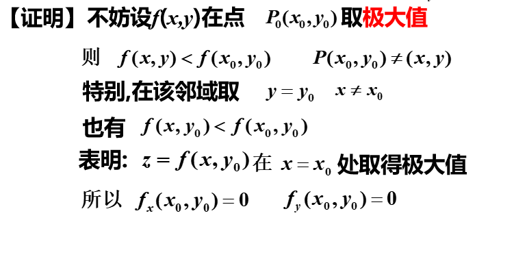
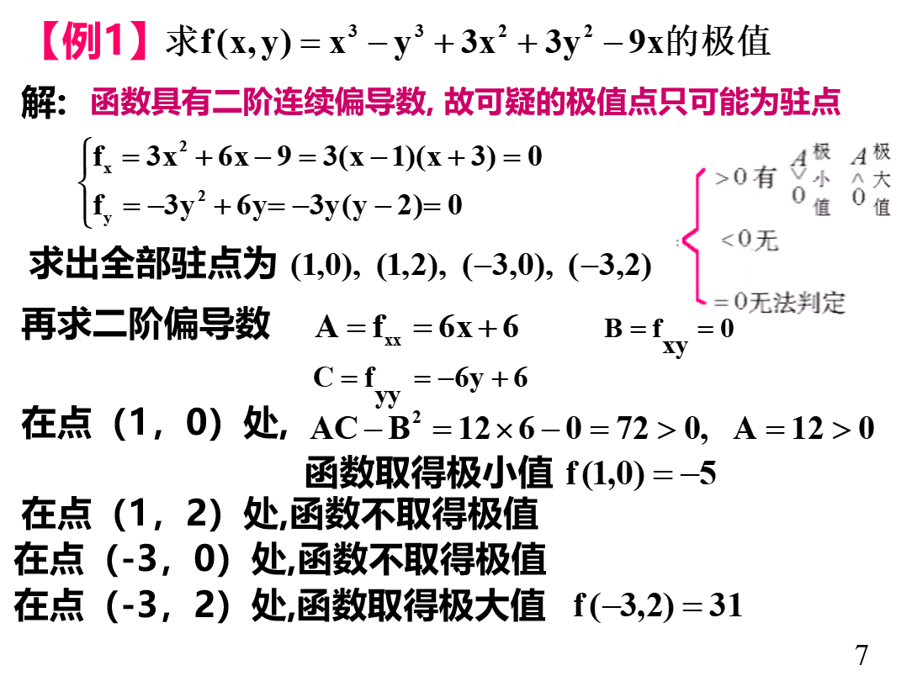

# 1 多元函数的极值
## 1.1 多元函数极值的定义
设函数$z=f(x,y)$在点$P_{0}(x_{0},y_{0})$的某个领域内有定义,若对该领域内异与$P_{0}((x_{0},y_{0})$都有$f(x,y)<f(x_{0},y_{0})$(或$f(x,y)>f(x_{0},y_{0})$),则称f(x,y)在点$P_{0}(x_{0},y_{0})$取极大值(或极小值).

-----

## 1.2 函数取得极值的必要条件
**定理一:设函数在点$P_{0}(x_{0},y_{0})$具有偏导数,$P_{0}(x_{0},y_{0})$为极值点,则$f_{x}(x_{0},y_{0})=f_{y}(x_{0},y_{0})=0$**

-----
## 1.3 函数取得极值的充分条件
**定理二:设$z=f(x,y)$在点$(x_{0},y_{0})$的某领域内连续且有一阶和二阶连续的偏导数且$f_{x}(x_{0},y_{0})=f_{y}(x_{0},y_{0})=0$,记$A=f_{x x}(x_{0},y_{0}) \quad B =f_{x y}(x_{0},y_{0}) \quad C = f_{yy}(x_{0},y_{0}) $则**
**(1)当$AC-B^{2}>0 \quad (x_{0},y_{0})$是极值点时,**
$A<0$ 是极大值点
$A>0$ 是极小值点
**(2)当$AC-B^{2}<0 \quad (x_{0},y_{0})$不是极值点**
**(3)当$AC-B^{2}=0 \quad (x_{0},y_{0})$不能确定是极值点**

----
# 2 多元函数的最值

1. 有界闭区域上连续函数的最值确定

设二元函数$z=f(x,y)$在有界闭区域D上连续,则$f(x,y)$在D上必定取得最值.

(1)函数在$D$的内部取得最值点,且$f(x,y)$在$D$内可(偏)导则该点是极值点,也是驻点,或是偏导数不存在的点.
(2)函数在边界上取得最值

2. 开区域上函数的最值确定

若根据实际问题的性质可断定函数的最值一定在$D$(开区域)上取得,而函数在$D$上仅有一个驻点,则该驻点就是最值点.

