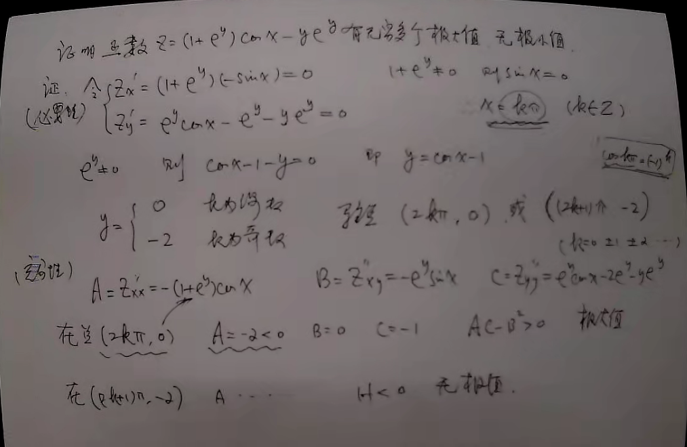
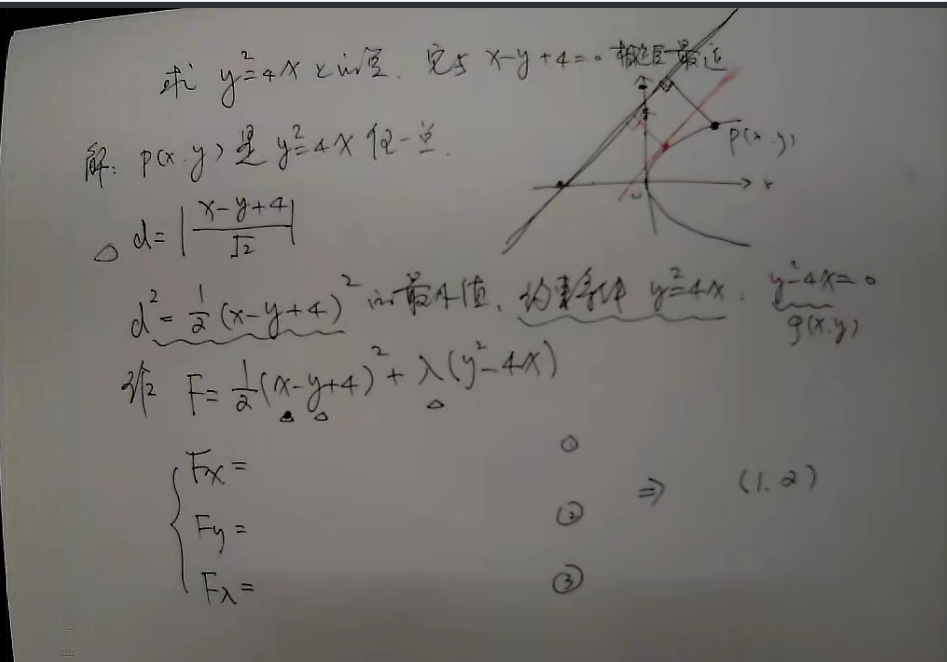
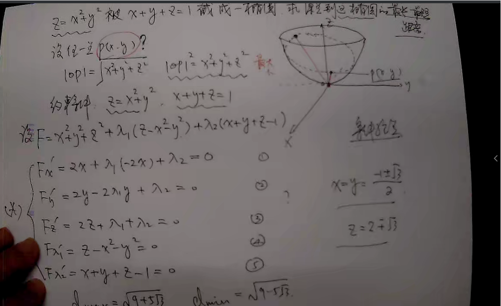
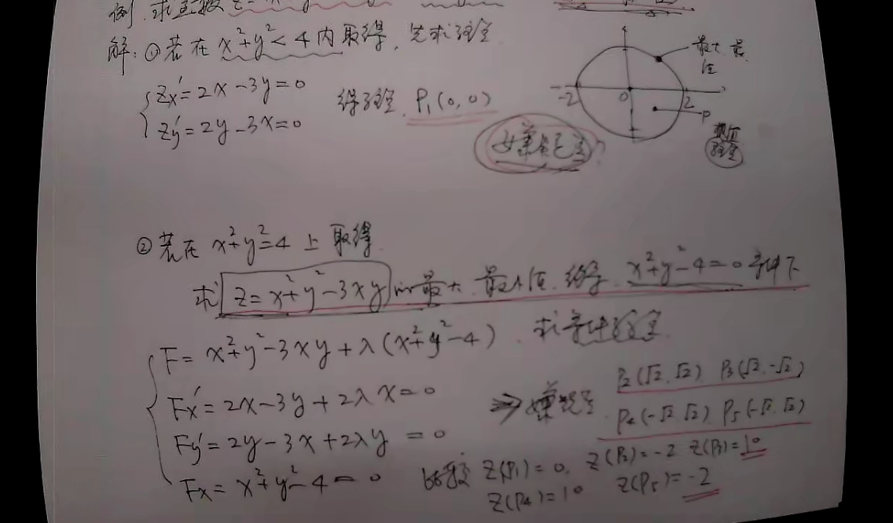
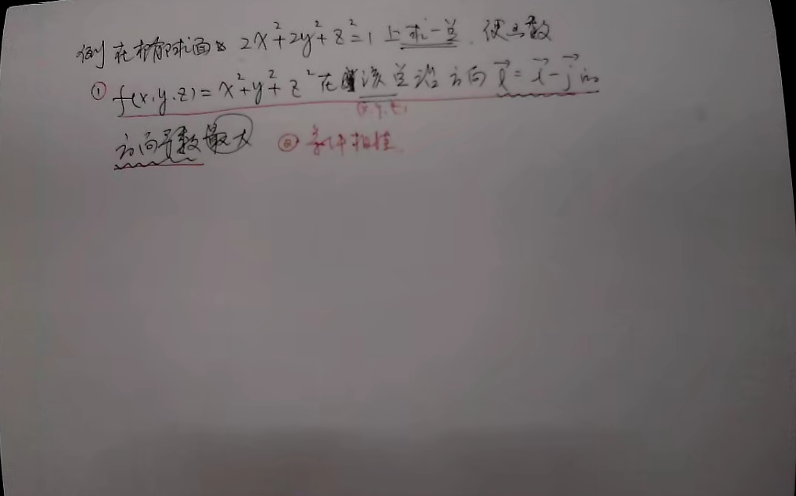

# 例一:P144 
2.证明函数$z = (1+e^{y})\cos x-ye^{y}$有无穷多个极大值,但无极小值.

$$
\begin{cases}
z_{x}' = (1+e^{y})(-\sin x)=0 \\
z_{y}' = e^{y}\cos x-e^{y}-ye^{y}=0
\end{cases}
$$
$\because e^{y} \neq 0$则$\cos x -1 -y=0$,及$y=\cos x-1$,$\because 1+e^{y}\neq0 \quad \therefore \sin x=0$

$$
\therefore
y=
\begin{cases}
0 \quad \text{}\\
-2 \quad \text{}
\end{cases}
$$
驻点:$(2k \Pi, 0)$或$((2k+1)\Pi,-2)$

# 例二:

# 例三:P152 
5.抛物面$z=x^{2}+y^{2}$被平面$x+y+z=1$截成一椭圆,求原点到这椭圆的最长和最短距离.

# 例四:
求函数$z = x^{2}+y^{2}-3xy$在$x^{2}+y^{2} \le 4$上的最大值和最小值.

> $P_{5}应为(-\sqrt2, -\sqrt 2)$
# 例五:
在椭圆球面$2x^{2}+2y^{2}+z^{2}=1$上求一点,使函数$f(x,y,z)=x^{2}+y^{2}+z^{2}$在该
方向的沿方向$\vec l =\vec i- \vec j $方向导数最大
